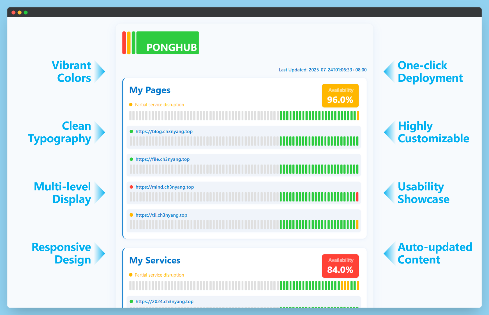

# [](https://health.ch3nyang.top)

<div align="center">

🌏 [Live Demo](https://health.ch3nyang.top) | 📖 [简体中文](README_CN.md)

</div>

## Introduction

PongHub is an open-source service status monitoring website designed to help users track and verify service availability. It supports:

- **🕵️ Zero-intrusion Monitoring** - Full-featured monitoring without code changes
- **🚀 One-click Deployment** - Automatically built with GitHub Actions, deployed to GitHub Pages
- **🌐 Cross-platform Support** - Compatible with public services like OpenAI and private deployments
- **🔍 Multi-port Detection** - Monitor multiple ports for a single service
- **🤖 Intelligent Response Validation** - Precise matching of status codes and regex validation of response bodies
- **🛠️ Custom Request Engine** - Flexible configuration of request headers/bodies, timeouts, and retry strategies



## Quick Start

1. Star and Fork [PongHub](https://github.com/WCY-dt/ponghub)

2. Modify the [`config.yaml`](config.yaml) file in the root directory to configure your service checks.

3. Modify the [`CNAME`](CNAME) file in the root directory to set your custom domain name.
   
   > If you do not need a custom domain, you can delete the `CNAME` file.

4. Commit and push your changes to your repository. GitHub Actions will automatically run and deploy to GitHub Pages and require no intervention.

> [!TIP]
> By default, GitHub Actions runs every 30 minutes. If you need to change the frequency, modify the `cron` expression in the [`.github/workflows/deploy.yml`](.github/workflows/deploy.yml) file.
> 
> Please do not set the frequency too high to avoid triggering GitHub's rate limits.

> [!IMPORTANT]
> If GitHub Actions does not trigger automatically, you can manually trigger it once.

## Configuration Guide

The `config.yaml` file follows this format:

| Field                     | Type   | Description                                      | Required |
|---------------------------|--------|--------------------------------------------------|----------|
| `timeout`                 | Integer| Timeout for each request in seconds              | ✖️       |
| `retry`                   | Integer| Number of retry attempts on request failure      | ✖️       |
| `max_log_days`            | Integer| Number of days to retain logs; logs older than this will be deleted | ✖️       |
| `services`                | Array  | List of services to monitor                      | ✔️      |
| `services.name`           | String | Name of the service                              | ✔️      |
| `services.health`         | Array  | Health check configurations for the service      | ✖️       |
| `services.health.url`     | String | URL to check                                     | ✔️      |
| `services.health.method`  | String | HTTP method (`GET`/`POST`/`PUT`)                 | ✖️       |
| `services.health.status_code` | Integer | Expected HTTP status code (default `200`)       | ✖️       |
| `services.health.response_regex` | String | Regex to match response body content            | ✖️       |
| `services.health.body`    | String | Request body content, used only for `POST` requests | ✖️       |
| `services.api`            | Array  | API check configurations, same format as above   | ✖️       |

Here is an example configuration file:

```yaml
timeout: 5
retry: 2
max_log_days: 30
services:
  - name: "GitHub API"
    health:
      - url: "https://api.github.com"
    api:
      - url: "https://api.github.com/repos/wcy-dt/ponghub"
        method: "GET"
        status_code: 200
        response_regex: "full_name"
  - name: "Ch3nyang's  Websites"
    health:
      - url: "https://example.com/health"
        response_regex: "status"
      - url: "https://example.com/status"
        method: "POST"
        body: '{"key": "value"}'
```

> [!NOTE]
> The `health` and `api` sections must have at least one entry. They are processed similarly, with this distinction made for future expansion.

## Disclaimer

[PongHub](https://github.com/WCY-dt/ponghub) is intended for personal learning and research only. The developers are not responsible for its usage or outcomes. Do not use it for commercial purposes or illegal activities.
