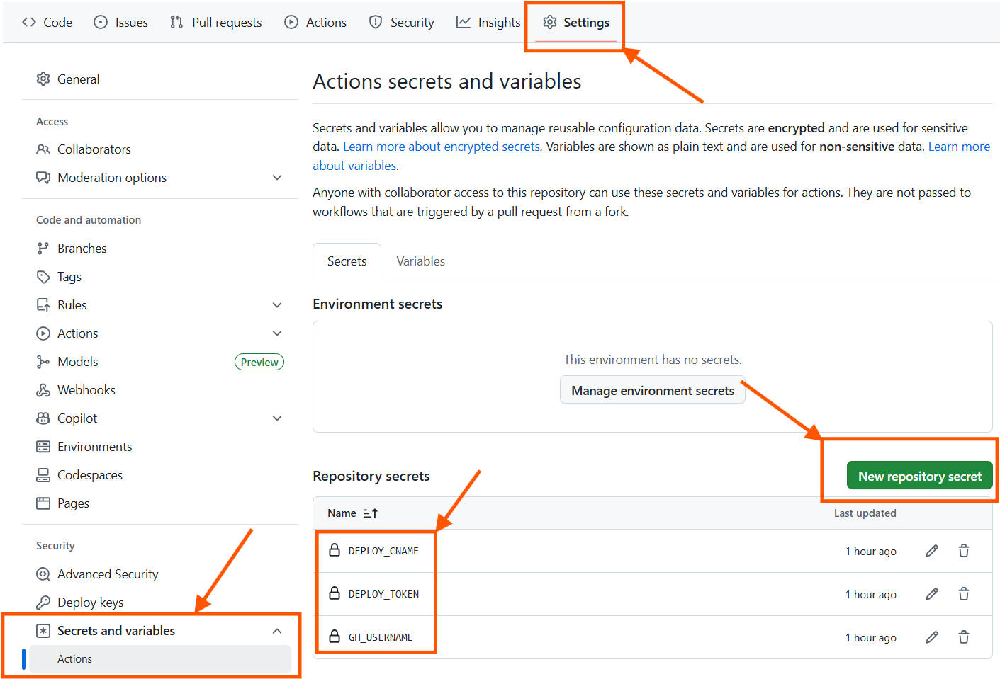

# [](https://health.ch3nyang.top)

<div align="center">

🌏 [Live Demo](https://health.ch3nyang.top) | 📖 [简体中文](README_CN.md)

</div>

## Introduction

PongHub is an open-source service status monitoring website designed to help users track and verify service availability. It supports:

- One-click CI/CD deployment using GitHub Actions and GitHub Pages
- Multi-port checks for individual services
- Status code matching and response body regex matching
- Custom request bodies
- Customizable configurations such as check intervals, retry attempts, timeout durations, etc.

## Quick Start

1. Star and Fork [PongHub](https://github.com/WCY-dt/ponghub)

2. In your forked repository, navigate to `Settings` -> `Secrets and variables` -> `Actions` and add the following Secrets:

    - `DEPLOY_TOKEN`: Your GitHub Personal Access Token, requiring at least `repo` and `workflow` permissions ([Get it here](https://github.com/settings/tokens))
    - `DEPLOY_CNAME`: Your desired custom domain, e.g., `health.ch3nyang.top`
    - `GH_USERNAME`: Your GitHub username, e.g., `WCY-dt`

    

3. Modify the [`config.yaml`](config.yaml) file in the root directory to configure your service checks.

4. Commit and push your changes to your repository. GitHub Actions will automatically run and deploy to GitHub Pages. Future updates will be automatic and require no intervention.

## Configuration Guide

The `config.yaml` file follows this format:

```yaml
timeout: 5
retry: 2
max_log_days: 30
services:
  - name: "GitHub API"
    health:
      - url: "https://api.github.com"
        method: "GET"
        status_code: 200
    api:
      - url: "https://api.github.com/repos/wcy-dt/ponghub"
        method: "GET"
        status_code: 200
        response_regex: "full_name"
  - name: "Ch3nyang's Websites"
    health:
      - url: "https://example.com/health"
        method: "GET"
        status_code: 200
        response_regex: "status"
      - url: "https://example.com/status"
        method: "POST"
        body: '{"key": "value"}'
```

- `timeout`: Request timeout duration in seconds
- `retry`: Number of retry attempts upon failure
- `max_log_days`: Maximum log retention period in days; older logs will be deleted
- `services`: **[Optional]​**​​ List of services
  - `name`: Service name
  - `health`: **[Optional]​** List of health check configurations
    - `url`: URL to check
    - `method`: HTTP method (GET, POST, etc.)
    - `status_code`: ​​**​[Optional]​**​​ Expected HTTP status code
    - `response_regex`: **[Optional]​** Regex pattern to match in the response body
    - `body`: ​​**​[Optional]​**​​ Request body content, used only for POST requests
  - `api`: ​​**​[Optional]​**​​ List of API check configurations, same format as above.

## Disclaimer

[PongHub](https://github.com/WCY-dt/ponghub) is intended for personal learning and research only. The developers are not responsible for its usage or outcomes. Do not use it for commercial purposes or illegal activities.
